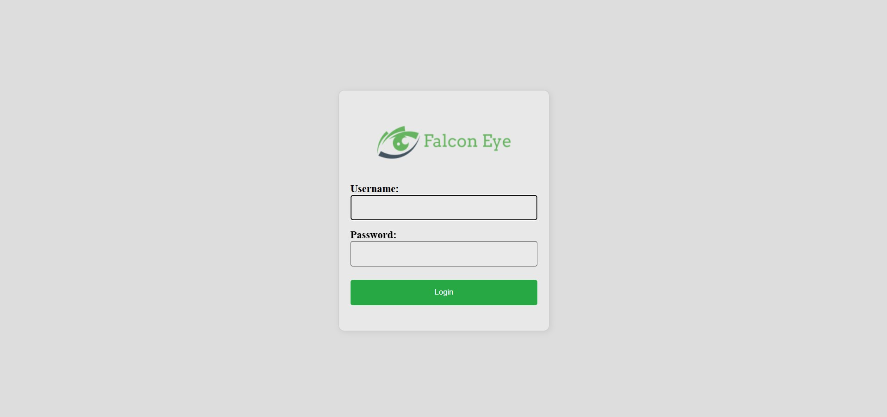
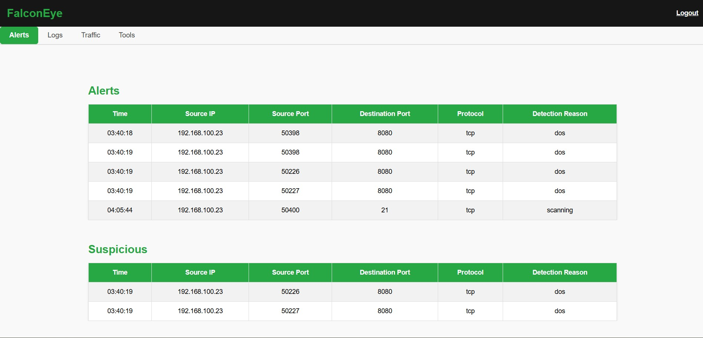
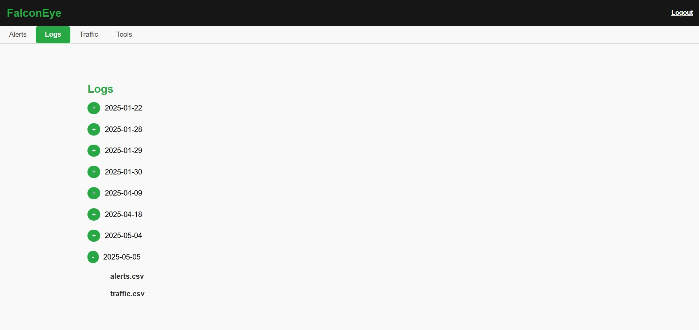
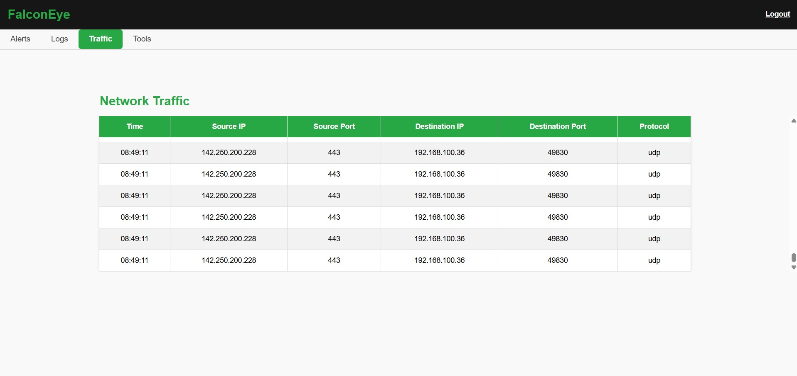
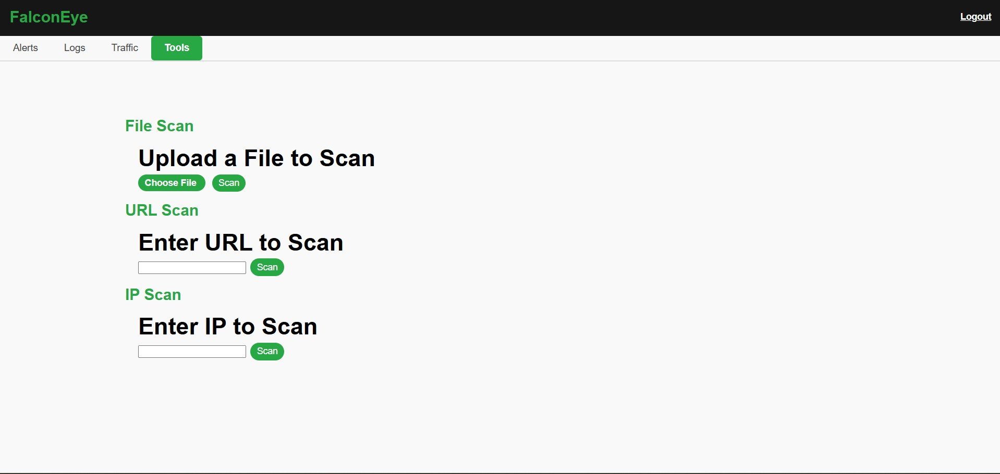

# Falcon-Eye-IDS
An Enhanced Intrusion Detection System Using Machine Learning Combined with Helpful Tools for Security Teams

# Dscription
Falcon Eye uses two machine learning algorithms (Decision Tree, Random Forest) to enhance the detection process by learning the patterns of an attack and using these patterns later for real-time detection.
Falcon Eye also provides some helpful tools similar to popular tools functionalities like Wireshark, Tcpdump, Dig, Whois, and VirusTotal file and URL scan all in one place.

# Buliding The System
Few steps needed before start using Falcon Eye
1. Run `training/train_preprocess.py` to process the dataset into machine learning compatible types.
2. Run `model/model.py` to bulid the machine learning models.
3. Enter the username and passsword you want inside `api.py` in line 19.
4. Enter your virus total api key inside `web/script.js` in line 1.
5. Edit the path to paythonw inside `falconEye.bat`

# How To Run
You can run `falconEye.bat` script to start the system componets, or you can do it manually by following these steps:
1. Run `FalconEye.py`.
2. Run `api.py`.
3. Open simple python http srever inside `web` directory.

# How To Use
Open the login interface at `http://localhost:8000/Login.html`

# Screenshots

**Figure 1:** Login Page

**Figure 2:** Alerts Page

**Figure 3:** Logs Page

**Figure 4:** Traffic Page

**Figure 5:** Tools Page

